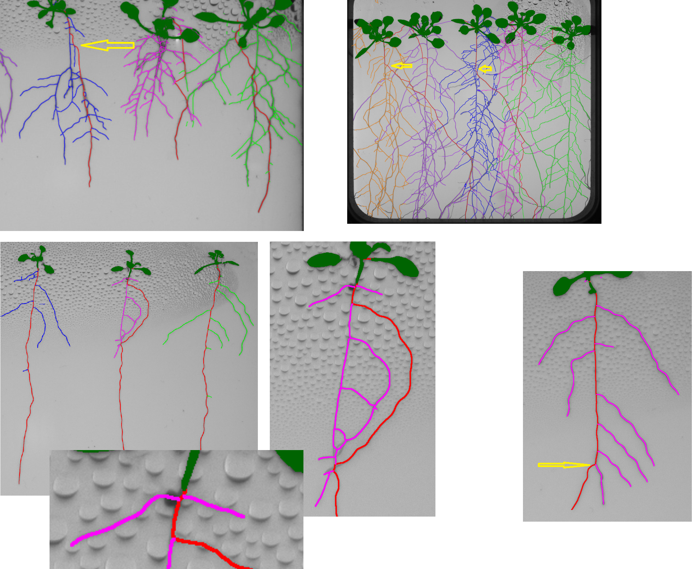

# Technical report Hades pipeline (phenotyper)

Note: I don't have the time to go thrrough the entire project so what I write here can be wrong. Also this is based on the version we are currently running, so it might include outdated implementations.

## Issue description
When running on complicated root images, the current pipeline becomes super slow (can go more than 15 minutes per dish) and unstable.

Monitor with py-spy, we can see where the major bottlenecks come from: 

```
Total Samples 6755500 GIL: 20.00%, Active: 101.00%, Threads: 3 OwnTime TotalTime Function (filename) 
24568s 24583s inpainter_correcter (pyphenotyper\features\features.py) 
2930s 22686s compute_cumulative_angle_deviation (pyphenotyper\features\roots_segmentation.py) 
8709s 9126s route_through_array (skimage\graph\mcp.py) 
7985s 8172s norm (numpy\linalg\linalg.py)
989.3s 10213s build_biased_graph (pyphenotyper\features\roots_segmentation.py) 
```

They are all CPU heavy (GPU always idle).

## Pure Computational Redundancy (no logic changes)

### `compute_cumulative_angle_deviation(coords)`

The major waste here are
1. repeatedly compute norm
2. repeatedly build small arrays
3. `math.acos()` is costly and sensitive near 0/π

Original function

```python
def compute__deviation(coords):
    """
    Compute the sum of angle deviations along the path segments.
    Smaller values mean straighter path.
    """
    total_angle = 0
    for i in range(1, len(coords) - 1):
        y0, x0 = coords[i - 1]
        y1, x1 = coords[i]
        y2, x2 = coords[i + 1]

        v1 = np.array([x1 - x0, y1 - y0])
        v2 = np.array([x2 - x1, y2 - y1])

        if np.linalg.norm(v1) == 0 or np.linalg.norm(v2) == 0:
            continue

        # angle between vectors (in radians)
        angle = math.acos(np.clip(np.dot(v1, v2) / (np.linalg.norm(v1) * np.linalg.norm(v2)), -1.0, 1.0))
        total_angle += angle

    return total_angle
```

For this `angle`, problems are likely to occur in these situations:
1. θ is close to 0 or π (almost collinear)
2. cosθ is very close to ±1
3. Floating-point errors can cause cosθ = 1.0000000002 (that's why `np.clip` is needed)
3. acos approaches infinity near ±1, amplifying numerical noise.
5. accuracy is actually not good at small angles.

Improved version with identical behavior:

```python
def compute_cumulative_angle_deviation(coords):
    total_angle = 0.0
    for i in range(1, len(coords) - 1):
        y0, x0 = coords[i - 1]
        y1, x1 = coords[i]
        y2, x2 = coords[i + 1]

        v1x, v1y = x1 - x0, y1 - y0
        v2x, v2y = x2 - x1, y2 - y1

        # skip zero length
        if (v1x == 0 and v1y == 0) or (v2x == 0 and v2y == 0):
            continue

        cross = v1x * v2y - v1y * v2x
        dot   = v1x * v2x + v1y * v2y

        total_angle += math.atan2(abs(cross), dot)

    return total_angle
```
- removed small `np.array` assign
- avoid `np.linalg.norm(v1)` / `np.linalg.norm(v2)`
- use `atan2(|cross|, dot)` to replace acos (common trick)
    - `abs(cross)`: unsigned corner (we only need "how much it bends," not whether it's a left or right bend).
    - dot can be negative: When the two segments are in opposite directions (close to 180°), `atan2(|cross|, dot)` will approach π, which will be severely penalized (as designed)


### `select_best_path(G,...)`

Delaying the calculation of `cumulative_angle` can save a lot: the current version calculate the cumulative angle for all reachable nodes' paths, but ultimately the angle will only be used in the top_n of the largest dy:

```python
def select_best_path(G, start_node, coord_map, min_dy_ratio=0.8, min_length=2, top_n=1):
    if start_node not in G:
        return []

    try:
        _, paths = nx.single_source_dijkstra(G, start_node, weight='cost')
    except nx.NetworkXNoPath:
        return []

    path_infos = []

    for node, path in paths.items():
        if node == start_node or len(path) < min_length:
            continue

        coords = [coord_map[n] for n in path if n in coord_map]
        if len(coords) < 2:
            continue

        y0, x0 = coords[0]
        y1, x1 = coords[-1]
        dy = y1 - y0
        dx = abs(x1 - x0)
        if dy <= 0:
            continue

        cumulative_angle = compute_cumulative_angle_deviation(coords)

        path_infos.append({
            'path': path,
            'dy': dy,
            'angle_deviation': cumulative_angle,
        })

    if not path_infos:
        return []

    # Step 1: Top N longest downward paths
    max_dy = max(p['dy'] for p in path_infos)
    dy_cutoff = max_dy * min_dy_ratio
    dy_candidates = [p for p in path_infos if p['dy'] >= dy_cutoff]
    dy_candidates.sort(key=lambda p: p['dy'], reverse=True)
    dy_candidates = dy_candidates[:top_n]

    # Step 2: Among them, select path with lowest total angle deviation
    best = min(dy_candidates, key=lambda p: p['angle_deviation'])

    return best['path']
```

The current process is:
1. For each path: Construct `coords` (all points along the entire path)
2. For each path: Calculate `cumulative_angle`
3. Only then filter to `dy_candidates[:top_n]` based on `dy`
4. `Angle_deviation` is only compared in `top_n`

Therefore, step 2 (angle) is wasted on most paths.

The correct lazy evaluation strategy is:
1. In the first round, only calculate `dy` (determine the candidate set)
2. In the second round, only calculate `coords` and `cumulative_angle` for the candidate set (usually very small, e.g., top_n=1/3/5).

```python
def select_best_path(G, start_node, coord_map, min_dy_ratio=0.8, min_length=2, top_n=1):
    if start_node not in G:
        return []

    try:
        _, paths = nx.single_source_dijkstra(G, start_node, weight='cost')
    except nx.NetworkXNoPath:
        return []

    path_infos = []
    max_dy = None  # track max dy to save max() traverse

    # --- Step 0: calculate dy only without building coords ---
    for node, path in paths.items():
        if node == start_node or len(path) < min_length:
            continue

        # equivalent tocoords = [coord_map[n] for n in path if n in coord_map]
        # but we need only the first and last point of this coords to calculate dy
        first = None
        last = None
        for n in path:
            c = coord_map.get(n)
            if c is None:
                continue
            if first is None:
                first = c
            last = c

        if first is None or last is None:
            continue

        dy = last[0] - first[0]
        if dy <= 0:
            continue

        info = {'path': path, 'dy': dy}
        path_infos.append(info)

        if max_dy is None or dy > max_dy:
            max_dy = dy

    if not path_infos:
        return []

    dy_cutoff = max_dy * min_dy_ratio

    # --- Step 1: filter and get top_n (still ranked with dy） ---
    dy_candidates = [p for p in path_infos if p['dy'] >= dy_cutoff]
    dy_candidates.sort(key=lambda p: p['dy'], reverse=True)
    dy_candidates = dy_candidates[:top_n]

    # --- Step 2: only calculate angle for candidate (build the coords here) ---
    best = None
    best_angle = None

    for p in dy_candidates:
        # same as "if n in coord_map"
        coords = [coord_map[n] for n in p['path'] if n in coord_map]
        # previously if coords < 2 continue; here we already have dy>0, in principle >=2 but kept for safety.
        if len(coords) < 2:
            continue

        angle = compute_cumulative_angle_deviation(coords)

        if best is None or angle < best_angle:
            best = p['path']
            best_angle = angle

    return best if best is not None else []
```

If you are certain that `coord_map` has coordinates for the first and last nodes of the path (or you accept discard paths with missing coordinates), you can directly calculate `dy` using the coordinates of `path[0]` and `path[-1]`. This is more efficient because you don't need to scan the entire path to find `first` and `last`. However, this will change the behavior in boundary cases of "missing coordinates in the middle, but not at the beginning or end" vs. "missing coordinates at the beginning and end, but with coordinates in the middle", therefore I didn't implement.


### `inpainter_correcter(im: np.ndarray, inpainted: np.ndarray) -> np.ndarray`

The core logic of this function is, if I understood it correctly: Divide the `diff` (new region) into connected components; Try adding `im1` back piece by piece; If the number of connected components in the **entire graph** decreases after adding back, consider this piece a "valid repair" and keep it:

```python
def inpainter_correcter(im: np.ndarray, inpainted: np.ndarray) -> np.ndarray:
    '''
    Corrects the inpainted plant root mask by removing incorrect lateral root growth.

    To be further explored

    :param im: Original plant root mask as a numpy array.
    :param inpainted: Inpainted plant root mask as a numpy array.
    :return: Corrected plant root mask with valid inpainted corrections and without incorrect lateral roots.
    '''
    
    # Binarize the original and inpainted images
    im1 = (im > 0).astype(np.uint8)
    im2 = (inpainted > 0).astype(np.uint8)

    # Calculate the difference between inpainted and original images
    diff = im2 - im1

    # Compute connected components for the difference image
    _, labels, _, _ = cv2.connectedComponentsWithStats(diff, connectivity=8)
    
    # Initialize the filling image with the first connected component (label 1)
    filling_image = (labels == 1)
    
    # Create a copy of the original binarized mask to store the corrected image
    corrected_im = im1.copy()
    
    # Compute the number of connected components in the original mask
    num_cc_before_inpainting, _, _, _ = cv2.connectedComponentsWithStats(im1, connectivity=8)
    
    # Iterate over each connected component in the difference image
    for filling_id in np.unique(labels):
        if filling_id == 0:
            continue
        
        # Create a binary image for the current connected component
        filling_image = labels == filling_id
        
        # Compute the number of connected components if the current filling_image is added to the original mask
        num_cc_after_inpainting, _, _, _ = cv2.connectedComponentsWithStats(filling_image + im1, connectivity=8)
        
        # If adding the current filling_image reduces the number of connected components, it's a valid correction
        if num_cc_after_inpainting < num_cc_before_inpainting:
            corrected_im = corrected_im + filling_image
    
    return corrected_im
```

This logic is, ehh, I don't understand why it's written like that because, to archive the same goal, rather than comparing the CC count with the whole graph which is extremely costly when we have high resolutions, one can simply just check if this region connects two existing components. They are topological equivalent (“reduces CC count” ⇔ “touches ≥2 original components”).

Let:
- `im1` = binarized original mask (foreground pixels are 1)
- `diff` = pixels that are present in the inpainted mask but not in the original (the “newly added” pixels)
- `C_k` = one 8-connected component of `diff`

The current implementation loops over each `C_k` and computes:
- `cc_before` = #CC(`im1`)
- `cc_after` = #CC(`im1` ∪ `C_k`) (by `connectedComponentsWithStats(filling_image + im1)`)

Then it accepts `C_k` iff: #CC(`im1` ∪ `C_k`) < #CC(`im1`), which is equivalent to: `C_k` is 8-neighbor adjacent to pixels from at least 2 distinct CCs of `im1`.

Proof:

Think of 8-connectivity as a graph:
- each foreground pixel is a node; 
- edges connect 8-neighbors

`im1` is a disjoint union of connected components A1,A2,…,An.

Now add one new connected set Ck (a single component of diff). There are only three possibilities:
1. Ck touches no original component: Then it forms a brand-new component by itself. #CC increases by 1, never decreases.
2. Ck touches exactly one original component Ai: Then Ck becomes attached to Ai, but it doesn’t connect Ai to any other Aj. #CC stays the same.
3. Ck touches two or more distinct original components (say Ai, Aj, i≠j): Because Ck is itself connected, it provides a path from Ai into Ck and out into Aj. So those original components become one merged component. #CC decreases (by at least 1).

So the only way for the number of connected components to go down is if the new diff component bridges ≥2 distinct original components.


The implementation of the second algorithm (this version also use `diff = (im2 > im1).astype(np.uint8)` to aviod uint underflow to 255)

```python
def inpainter_correcter(im: np.ndarray, inpainted: np.ndarray) -> np.ndarray:
    """
    Output-identical speedup of the original implementation.

    Accepts a diff component iff adding it reduces the number of 8-connected components.
    This is equivalent to: the diff component is 8-neighbor adjacent to >=2 distinct components of im1.
    """

    # Binarize the original and inpainted images
    im1 = (im > 0).astype(np.uint8)
    im2 = (inpainted > 0).astype(np.uint8)

    # Only new pixels added by inpainting to aviod uint8 underflow
    diff = (im2 > im1).astype(np.uint8) 

    # Label diff components once
    num_fill, labels_fill, stats, _ = cv2.connectedComponentsWithStats(diff, connectivity=8)

    # Label original components once
    _, labels_orig = cv2.connectedComponents(im1, connectivity=8)

    corrected_im = im1.copy()
    H, W = im1.shape
    kernel = np.ones((3, 3), np.uint8)

    for k in range(1, num_fill):
        x, y, w, h, area = stats[k]
        if area <= 0:
            continue

        # Expand ROI by exactly 1 pixel to capture 8-neighbor adjacency
        x0 = max(x - 1, 0); y0 = max(y - 1, 0)
        x1 = min(x + w + 1, W); y1 = min(y + h + 1, H)

        roi_comp = (labels_fill[y0:y1, x0:x1] == k).astype(np.uint8)
        if roi_comp.max() == 0:
            continue

        # Exact 8-neighborhood of component pixels (radius 1)
        roi_neigh = cv2.dilate(roi_comp, kernel, iterations=1).astype(bool)

        touching = labels_orig[y0:y1, x0:x1][roi_neigh]
        touching = touching[touching != 0]

        # Equivalent to: CC(im1 + comp) < CC(im1)
        if touching.size and np.unique(touching).size >= 2:
            # preserve original arithmetic behavior (+, not OR)
            corrected_im[y0:y1, x0:x1][roi_comp.astype(bool)] = (
                corrected_im[y0:y1, x0:x1][roi_comp.astype(bool)] + 1
            )

    return corrected_im
```


### build_biased_graph()

This function also contains algorithm design issues (see next chapter). In this section we focus on pure computational wastes.

The above version is a purely computational fix where:
1. removed unnecessary array head assign
2. aviod acos usage again

The logical part remains untouched for now

```python
def build_biased_graph(
    mask_full_branch,
    full_skeleton,
    head_length=50,
    angle_penalty=50.0,
    crop_padding=500,
    reverse_penalty_factor=5.0,
    allow_reverse=False,
    forbid_upward=True
):
    G = nx.DiGraph()

    # micro optimization with local binding
    h, w = full_skeleton.shape
    route = skimage.graph.route_through_array
    hypot = math.hypot
    atan2 = math.atan2
    degrees = math.degrees
    abs_ = abs

    for _, row in mask_full_branch.iterrows():
        src = row['node-id-src']
        dst = row['node-id-dst']
        y_src = int(row['image-coord-src-0'])
        x_src = int(row['image-coord-src-1'])
        y_dst = int(row['image-coord-dst-0'])
        x_dst = int(row['image-coord-dst-1'])

        G.add_node(src)
        G.add_node(dst)

        # Crop region for localized pathfinding
        y_min = max(0, min(y_src, y_dst) - crop_padding)
        y_max = min(h, max(y_src, y_dst) + crop_padding)
        x_min = max(0, min(x_src, x_dst) - crop_padding)
        x_max = min(w, max(x_src, x_dst) + crop_padding)

        sub_skeleton = full_skeleton[y_min:y_max, x_min:x_max]
        offset_src = (y_src - y_min, x_src - x_min)
        offset_dst = (y_dst - y_min, x_dst - x_min)

        try:
            path_pixels, _ = route(
                1 - sub_skeleton,
                offset_src,
                offset_dst,
                fully_connected=True
            )
        except Exception:
            continue

        if len(path_pixels) < 2:
            continue

        # Extract head segment for angle calculation
        end = head_length if head_length < len(path_pixels) else len(path_pixels)
        if end < 2:
            continue
        head = path_pixels[:end]

        # aviod numpy array assign
        y0, x0 = head[0]
        y1, x1 = head[-1]
        dy = y1 - y0
        dx = x1 - x0

        length = hypot(dx, dy)
        if length == 0:
            continue

        if forbid_upward and dy < 0:
            continue

        # angle: acos(dy/len) == atan2(|dx|, dy) when dy>=0
        angle_deg = degrees(atan2(abs_(dx), dy))

        cost = angle_penalty * (angle_deg / 180.0)

        G.add_edge(
            src, dst,
            cost=cost,
            dy=dy,
            dx=dx,
            angle_deg=angle_deg,
            length=length
        )

        if allow_reverse:
            reverse_cost = cost * reverse_penalty_factor
            G.add_edge(
                dst, src,
                cost=reverse_cost,
                dy=-dy,
                dx=-dx,
                angle_deg=angle_deg,
                length=length
            )

    return G

```

## Logic changes and bug fix

### Minor fix in segmentation_primary()
Currently at

```python
if y1 < y2:
    G_biased.add_edge(tip1, tip2, score=-best_dist, virtual=True)
```

There's no weight assigned, which might result in using the NetworkX default 1. Change to:

```python
if y1 < y2:
    # NetworkX's default cost is 1, which makes later nx.single_source_dijkstra(G_biased, start_node, weight='cost') using 1 as cost for virtual edges, which can cause unexpected behavior
    virtual_cost = best_dist  # safest: use dist as cost
    # or virtual_cost = best_dist * some_factor if want heavy penalty on virtual edge
    G_biased.add_edge(tip1, tip2, cost=virtual_cost, score=-best_dist, virtual=True)
```

### Error analysis

We continue with this function. Let's first look at some fail cases:



TBC

### build_biased_graph()

### select_best_path()
